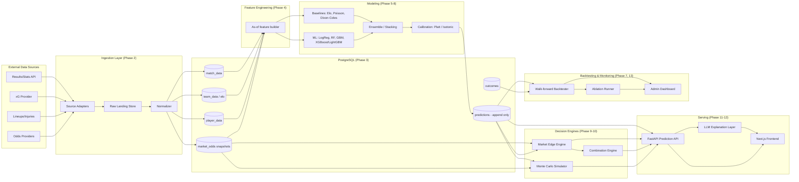

# Architecture

Football AI is a **separate product** from the SpeakUp app that otherwise
lives in this repository. It is scaffolded under `football-ai/` as a
self-contained subproject (own backend, frontend, database, docs) so it can
eventually be extracted to its own repo/deployment without touching SpeakUp.

## 1. Design principles (from the product brief)

1. **The LLM never computes a probability.** It only explains numbers that
   already came out of statistical/ML models (Section 17).
2. **No data point is used before it existed.** Every ingested fact carries
   `source`, `timestamp`, `match_id`, `value` — the prediction pipeline can
   only read facts with `timestamp <= prediction_generated_at` (Section 4).
3. **Predictions are immutable once logged.** A prediction row is written
   before kickoff and never edited — only a separate `outcome` row is
   attached later (Section 15).
4. **Nothing is presented as certainty.** Every probability in the API/UI
   layer is typed as a probability (0–1, sums to 1 across a market's
   outcomes), never as a "pick" or a guarantee (Sections 1, 16).
5. **A model change ships only if walk-forward backtesting shows it helps
   out-of-sample.** There is no manual "nudge the probabilities" path
   (Section 5–6, Section 27).

## 2. High-level component diagram



## 3. Repository layout

```
football-ai/
  docs/                    # this file + all *.md docs required by the brief
    research/              # Phase 0 provider research
  backend/
    app/
      core/                # config, settings (env-driven, no hardcoded keys)
      db/                  # SQLAlchemy models + session, mirrors db/migrations
      models_stat/         # pure statistical/ML code: Elo, Poisson, Dixon-Coles,
                            # odds<->prob, calibration, metrics, Monte Carlo,
                            # correlation-aware combination probability
      services/            # orchestration: edge engine, combination engine,
                            # backtester, ablation runner
      schemas/              # Pydantic request/response models
      api/routers/          # FastAPI routers, one per Section 19-23 page
      main.py
    tests/                  # unit + integration tests (Section 24)
    requirements.txt
    Dockerfile
  frontend/                 # Next.js + TypeScript + Tailwind (Section 18)
  db/
    migrations/             # raw SQL migrations (source of truth for schema)
  infra/
    docker-compose.yml
  .env.example
  ROADMAP.md
```

Backend and frontend are separate deployables from day one (matches the
brief's stack: Python/FastAPI backend, Next.js frontend), communicating only
over the HTTP API defined in `API.md`.

## 4. Why PostgreSQL, why this ORM boundary

- Relational integrity matters here: a prediction row must be able to prove,
  via foreign keys and timestamps, exactly which snapshot of odds/team data
  fed it (Section 4's reconstructability requirement).
- `models_stat/` never imports `db/` — statistical code takes plain
  `numpy`/`pandas` structures in and out, so it can be unit-tested with
  synthetic data with zero database dependency (Section 24), and reused
  identically inside the backtester (which replays historical rows) and the
  live API (which reads current rows).

## 5. Data leakage boundary (see also `DATA.md` §4)

The only place "as-of" logic lives is `app/services/feature_builder.py`
(feature engineering). It takes a `prediction_as_of: datetime` argument and
every query it issues is filtered `WHERE observed_at <= prediction_as_of`.
No other code path is allowed to build model features directly from raw
tables — this is enforced by a leakage test suite (`tests/test_leakage.py`)
that asserts a feature computed "as of T-48h" is bit-for-bit identical
whether or not later rows exist in the database.

## 6. Environments

- **local/dev**: `docker-compose.yml` runs Postgres + backend + frontend.
- **CI**: runs `pytest` (backend) and `next lint`/`tsc` (frontend) on every
  change; migration + leakage tests are part of the required suite.
- **production**: out of scope until Phase 14; `DEPLOYMENT.md` describes the
  intended path without standing up real infrastructure yet.
